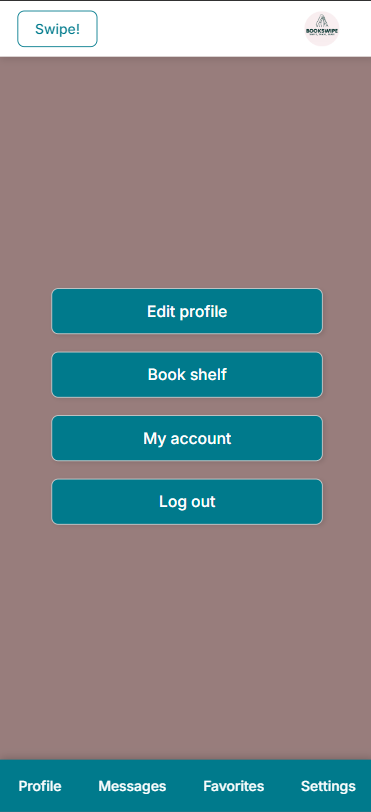

# BookSwipe :books:

## Índice

- [Proyecto 📚](#proyecto-)
    - [Requisitos previos](#requisitos-previos-)
- [Diagramas](#diagramas-)
    - [Diagrama de flujo](#diagrama-de-flujo-)
    - [Diagrama de datos](#diagrama-de-datos-)
- [Instalación 🛠️](#instalación-)
    - [Requerimientos](#requerimientos-)
- [Estructura del proyecto](#estructura-del-proyecto-)
- [Tecnologías](#tecnologías-)
- [Uso](#uso-)
- [Contribución 🤝](#contribución-)
- [Desarrolladoras 👩‍💻](#desarrolladoras-)
- [Demo](#demo-)

## Proyecto 

**BookSwipe** es una aplicación de intercambio de libros inspirada en Tinder. Los usuarios pueden deslizar libros hacia la izquierda o derecha para indicar si están interesados o no. Si dos usuarios coinciden en sus gustos (es decir, ambos han dado like a los libros del otro), pueden iniciar un chat para coordinar el intercambio de libros.

El frontend está desarrollado en React utilizando styled-components, mientras que el backend está construido en Django con Django REST Framework y una base de datos PostgreSQL.

### Requisitos previos

**Funcionalidades**
- Registro y autenticación de usuarios.
- Deslizamiento de libros para mostrar interés o no.
- Sistema de matches basado en los gustos de los usuarios.
- Chat entre usuarios con match para coordinar el intercambio de libros.
- Creación y eliminación de libros desde la página **BookShelf**.
- Visualización de libros en formato de tarjeta.
- Filtros para evitar que los usuarios vean sus propios libros en el swipe.

## Diagramas

### Diagrama de flujo

_(Agregar el enlace al diagrama de flujo si es necesario)_

### Diagrama de datos

_(Agregar el enlace al diagrama de datos o una captura de la estructura de la base de datos si es necesario)_

## Instalación 🛠️

### Requerimientos

- [Python 3.x](https://www.python.org/downloads/)
- [PostgreSQL](https://www.postgresql.org/download/)
- [Virtualenv](https://virtualenv.pypa.io/en/latest/)
- [Git](https://git-scm.com/)

1. Clona el repositorio del backend:

    ```bash
    git clone https://github.com/tu-usuario/bookswipe-back
    ```

2. Crea y activa un entorno virtual:

    ```bash
    cd bookswipe-back
    python -m venv env
    source env/bin/activate  # En Windows usa: env\Scripts\activate
    ```

3. Instala las dependencias:

    ```bash
    pip install -r requirements.txt
    ```

4. Configura tu base de datos PostgreSQL y añade las credenciales en el archivo `settings.py` de Django.

5. Realiza las migraciones y corre el servidor:

    ```bash
    python manage.py makemigrations
    python manage.py migrate
    python manage.py runserver
    ```

## Estructura del proyecto

El proyecto sigue una estructura común para aplicaciones Django y React, con una API organizada en diferentes módulos para una gestión eficiente.

```plaintext
/
├── bookswipe-backend
│   ├── books/
│   │   ├── migrations/
│   │   ├── models.py
│   │   ├── serializers.py
│   │   ├── views.py
│   ├── users/
│   │   └── ...
│   ├── matches/
│   │   └── ...
│   ├── utils/
│   │   └── ...
│   ├── manage.py
│   ├── requirements.txt
│   └── README.md
├── bookswipe-frontend
│   ├── components/
│   │   ├── Button/
│   │   ├── BookCard/
│   │   ├── Navbar/
│   ├── pages/
│   │   ├── Home.jsx
│   │   ├── BookShelf.jsx
│   │   └── ...
│   ├── App.js
│   └── ...

## Tecnologías

**Backend**
- [Python](https://www.python.org/)
- [Django](https://www.djangoproject.com/)
- [Django REST Framework](https://www.django-rest-framework.org/)
- [PostgreSQL](https://www.postgresql.org/)
- [Pillow](https://python-pillow.org/) para manejo de imágenes.

**Frontend** *(https://github.com/Fire-Fairy84/book_swipe_front)*
- [React.js](https://reactjs.org/)
- [Styled-components](https://styled-components.com/)
- [Axios](https://axios-http.com/es/docs/intro)

## Uso

Para iniciar la aplicación, asegúrate de que el servidor de backend esté corriendo:

```bash
python manage.py runserver
```
## Contribución 🤝

1. Haz un fork del repositorio.
2. Crea una nueva rama: 

   ```bash
   git checkout -b feature/nueva-funcionalidad
   ```
3. Realiza tus cambios y haz commit:
    ```bash
   git commit -m 'Agrega nueva funcionalidad'
   ```
4. Haz push de tu rama:  
    ```bash
   git push origin feature/nueva-funcionalidad
    ```
5. Crea un pull request.


## Este proyecto ha sido creado por:

- **Esther Sarasua**(https://github.com/Fire-Fairy84)


## Demo

A continuación, algunas capturas de la aplicación:

1. Página de inicio. 


2. Página de perfil.  



3. Swipe de libros.  


4. Estantería de libros.  


5. Añadir nuevo libro.  

